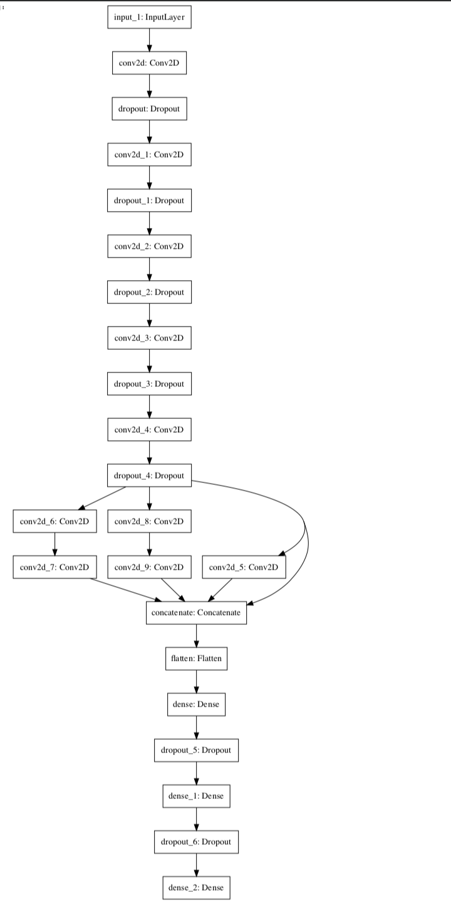

# **Traffic Sign Recognition** 

[//]: # (Image References)

[image1]: ./hist.png "Histogram"
[image2]: ./dataaug.png "Data Augmentation"
[image3]: ./modelarc.png "Model Architecture"
[image4]: ./newimgs.png "New Images"
[image5]: ./sft_new.png "Softmax"
[image6]: ./train.png "Model Training Accuracy"
[image7]: ./train2.png "Model Training Loss"

The steps of this project are the following:
* Data Loading
* Data Augmentation
* Model Architecture, Training, Oversampling.
* Testing

-------

## Data Loading

I used the pandas library to load the dataset and calculate a summary of the dataset.

* Shape of training features is (34799, 32, 32, 3)
* Shape of training labels is (34799,)

* Shape of validation features is (4410, 32, 32, 3)
* Shape of validation labels is (4410,)

* Shape of testing features is (12630, 32, 32, 3)
* Shape of testing labels is (12630,)

![Histogram of classes in training and validation set][image1]

The x-axis represents the classes and the y-axis represents the number of data points in eaxh class.

---------

## Data Augmentation

* The RGB images are converted to grayscale
* The dataset is augmented with the same images after these two steps:
    * The images are rotated by angle from -20 to 20
    * Noise of black pixels is added to the images with probability = 0.05

This should increase the size of the dataset and make the model more robust to images with variations that do not exist in the original dataset.  
This also acts as regularization to the model.

![Data augmentation][image2]

-------

## Model

### Architecture

* The model is a deep convolutional neural networks with inception module with resnet connection as the last convolutional layer.

* The dropout is used with probability=0.3 between the convolution layers and probability=0.5 between the fully connected layers to avoid overfitting.

* The filters of the convolution start with 64 and increase to 128.

<!-- ![Model Architecture][image3] -->

### Training

* I used Adam optimizer with learning rate = 3e-4 with batch size = 64

* The model is trained with decreasing learning rate if the validation loss does not improve for 2 epochs and the model stops training if the validation loss does not improve for 4 epochs. The training ends after 17 epochs.

![Model Training Accuracy][image6]

![Model Training Loss][image7]

**Validation loss is less than training loss as the training data is augmented with rotated and noisy data while validation data is not**

### Steps
* I first trained a base model then added more layers and resnet with inception module before the fully connected layers to increase the accuracy till I reached >  98% on training and validation data. But, adding more layers did not increase the accuracy.

* Since I am using many layers, I used dropout (0.3 between conv layers and 0.5 between fully connected layers) to prevent overfitting while adding more layers.

* I decreased/increased the learning rate till I found that 3e-4 a good starting value and it will decrease when loss does not improve.

* As I mention in the next subsection, oversampling does not add a value to this problem.

----

### Oversampling
* The data is unbalanced and there are some similar classes where one of them has more data.
* I did oversampling to increase the size of the classes with less data.
* Oversampling does not improve the model accuracy on the validation data, so it is ignored in the final results.

------

## Testing

### Validation set and Testing set performance

* Model accuracy of validation set = 98.75 %
* Model accuracy of testing set = 97.62 %

### Testing on new images from the web

The model have been tested on 11 images from the web.
The images are converted to grayscale and resized to be the same size as the training data. I did not add any noise or any rotation as I did on the training data. 
 **This definitely affects the results as resizing the images affects their qualitys**  
From the images below, it is clear that the images are much better than the training data, no blurry images and no noise.  
**This may affect the prediction a little bit as the model is trained on images that are blurry and noisy.** 

![New Images][image4]

* Model accuracy of the new images = 72.73 %. It is worse than the testing acciracy, but this is because the size is small and any misprediction will affect the performance. Moreover, the quality of the two datasets are different which affects the predictsion.

* we found that the model is not able to differentiate well between the speeds (numvbers). This may be because:
    * The classes are similar 
    * There are classes with fewer samples than other classes
    * The images are blurry

### However, the model erformance may be improved by pretraining on another dataset, such as MNIST dataset.

### Softmax analysis

* The model is not pretty sure about the wrong prediction except in the speed of 30 that was predicted as 80.  
This may be because the two classes are very similar
* The pedestrian class and the right-of-way at the next interestion class are similar, so when the model is wrong, it was not sure about the prediction.

![Softmax Analysis][image5]

